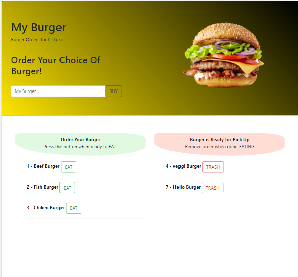

# MyBurger

# Deployed link:-

(https://immense-plateau-32951.herokuapp.com/)

# Description

Burger logger App with MySQL, Node, Express, Handlebars and a homemade ORM .

#

# Table of Contents

* [Installation](#installation)

* [Usage](#usage)

* [License](#license)

* [Contributing](#contributing)

* [Tests](#tests)

* [Questions](#questions)

# Installation

Dependencies must be installed to run the application properly: 

* express

* express-handlebars

* mysql

# Usage

* **MyBurger!** is a restaurant app that lets users input the names of burgers they'd like to eat.

* Whenever a user submits a burger's name, your app will display the burger on the left side of the page -- waiting to be devoured.

* Each burger in the waiting area also has an EAT! button. When the user clicks it, the burger will move to the right side of the page.

* Your app will store every burger in a database, whether devoured or not unless it is deleted .

# License

This project is license under the **MIT** license.

# Contributing

* Contributors: Bethlehem Balcha

# Tests

To run tests, you need to run the following command: NONE

# Questions

* If you have any questions:-

* GitHub username: @bettycode

* Email: betty.haile.us@gmail.com

## youtube video link: 

